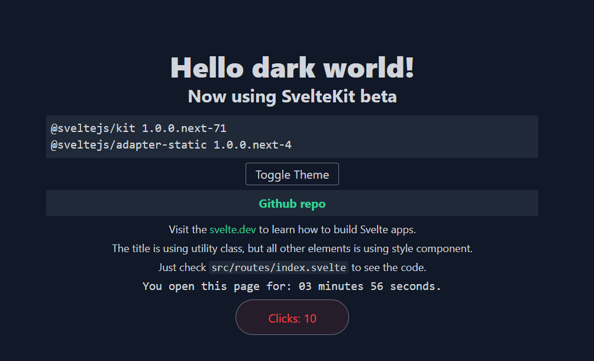

## SvelteKit (vite) with Tailwind

## now version 0.0.2

This boilerplate is fresh init from `svelte@next` at the time of writing, the versions I get are as follows

```
@sveltejs/kit 1.0.0.next-49
@sveltejs/adapter-static 1.0.0.next-3
```

## Demo



Go to [**Live Demo**](https://sveltekit-tailwind2.netlify.app/)

## Running the project

Clone this repo and cd to the directory, then run npm or yarn

```bash
npx degit dansvel/sveltekit-typescript-postcss-tailwind2 myproject
cd myproject
pnpm install ## or npm or yarn
pnpm run dev
```

Open up your favorite browser, go to localhost:3000 and try clicking around.

Or you can play with the code, just check `src/routes/index.svelte` and try to edit the CSS.

## build and generate static web

```bash
pnpm run build
```

with the command above, now you can generate static web, you can deploy the project in netlify, begin, vercel or else

## Documentation
 - dev.to post [here](https://dev.to/dansvel/sveltekit-svelte-next-with-tailwind-2-4dnn) are outdate.
 - please read the [official documentation](https://github.com/sveltejs/kit/tree/master/documentation)
## Credits

- [svelte-local-storage-store](https://github.com/joshnuss/svelte-local-storage-store) by Joshua Nussbaum
