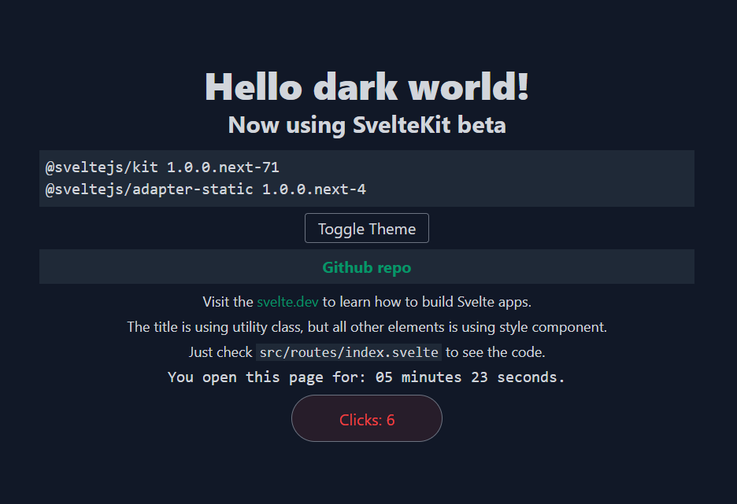

# SvelteKit (vite) using typescript with Tailwind

## Changelog

### Now version 0.0.4
Looks like this will be the last beta version, hope the stable version will be released soon.

- ```
  @sveltejs/kit 1.0.0.next-110 
  @sveltejs/adapter-static 1.0.0.next-12
  ```
- `@tailwindcss/jit` already merge to `tailwindcss 2.1`, read https://blog.tailwindcss.com/tailwindcss-2-1 for more detail
  
> Still using `postcss-preset-env to postcss-nested`, feel free to replace it back

### version 0.0.3

- **SvelteKit beta**
  ```
  @sveltejs/kit 1.0.0.next-71 
  @sveltejs/adapter-static 1.0.0.next-4
  ```
- using `@tailwindcss/jit`
- replace `postcss-preset-env to postcss-nested`, feel free to replace it back
- add transition

### version 0.0.2

```
@sveltejs/kit 1.0.0.next-49
@sveltejs/adapter-static 1.0.0.next-3
```

## Demo



Go to [**Live Demo**](https://sveltekit-tailwind2.netlify.app/)

## Running the project

Clone this repo and cd to the directory, then run npm or yarn

```bash
pnpx degit dansvel/sveltekit-typescript-postcss-tailwind2 myproject
cd myproject
pnpm install ## or npm or yarn
pnpm run dev
```

Open up your favorite browser, go to localhost:3000 and try clicking around.

Or you can play with the code, just check `src/routes/index.svelte` and try to edit the something.

## build and generate static web

```bash
pnpm run build
```

with the command above, now you can generate static web, you can deploy the project in netlify, begin, vercel or else

## Documentation
 - dev.to post [here](https://dev.to/dansvel/sveltekit-svelte-next-with-tailwind-2-4dnn) (outdate).
 - please read the [official documentation](https://kit.svelte.dev/)

## Credits
- [svelte-local-storage-store](https://github.com/joshnuss/svelte-local-storage-store) by Joshua Nussbaum
